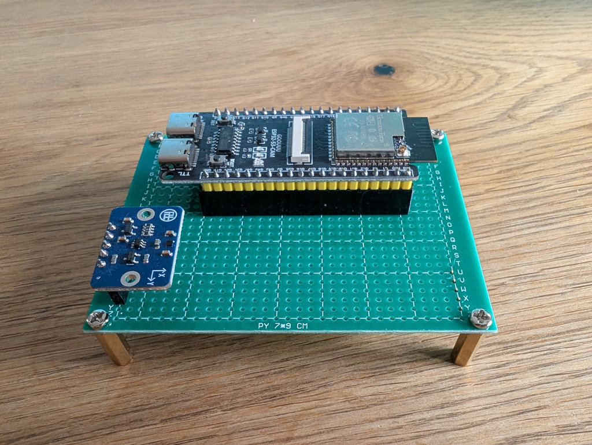
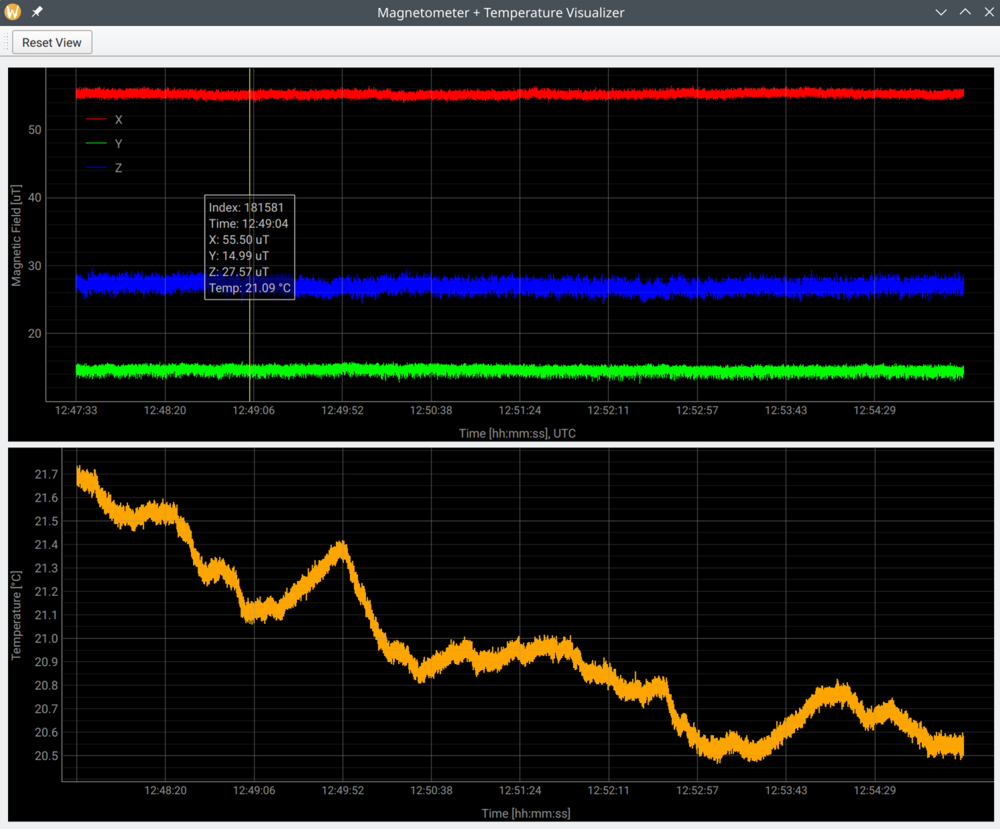

# ESP32-S3 + Bosch BMM350 Magnetometer

This project is a high-frequency magnetometer data streamer built around the ESP32-S3 and a Bosch Sensortec BMM350.

This firmware runs on an [ESP32-S3](https://www.espressif.com/en/products/socs/esp32-s3) and interfaces with a [Bosch Sensortec BMM350](https://www.bosch-sensortec.com/products/magnetometers/bmm350/) magnetometer.

- Samples X, Y, Z magnetic field axes at 400 Hz
- Adds a millisecond-precision Unix timestamp which is SNTP synchronized
- Sends data over UDP to a listening host

Samples are collected in blocks of 400 measurements (corresponding to 1 second of data at 400 Hz) to reduce overhead.  

Each sample is represented in the following C-style structure:

```c
typedef struct
{
    uint64_t timestamp; // Unix Timestamp
    float x;            // Magnetic field X-axis [µT]
    float y;            // Magnetic field Y-axis [µT]
    float z;            // Magnetic field Z-axis [µT]
    float temperature;  // Sensor temperature [°C]
} mag_sample_t;
```

## How to get this thing running

### 1. Wiring

| Signal        | ESP32-S3 GPIO | Description              |
|---------------|---------------|--------------------------|
| I²C SDA       | GPIO 47       | BMM350 I²C data          |
| I²C SCL       | GPIO 21       | BMM350 I²C clock         |
| Interrupt     | GPIO 01       | BMM350 data ready (INT)  |
| 3.3V          | —             | Sensor supply voltage    |
| GND           | —             | Common ground            |

### 2. Flash Firmware

```bash
# idf.py set-target esp32s3
# idf.py build
# idf.py flash monitor
```


### 3. Logger 

Run the UDP recorder with:

```bash
# python3 udp_recorder.py --port 12345 --output-dir data --prefix magneto
```

For description of all available use command ```--help```.


### 4. Visualizer

This is a simple PyQt5 + PyQtGraph-based visualizer for binary magnetometer data with timestamped measurements.



### Install

```bash
# pip install pyqt5 pyqtgraph
```

#### Usage

```bash
# python3 visualizer.py --file <filename>
```
